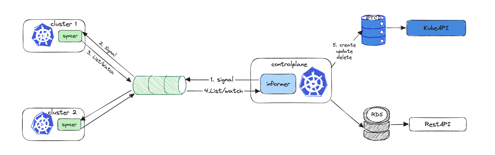

# MQTT Informer

## Description 


### Case 1: As a monitor to view resources from clusters



## Start eclipse-mosquitto MQTT Broker
```bash
echo "listener 1883 0.0.0.0
allow_anonymous true" > samples/mosquitto.conf
docker run --rm --name mosquitto -p 1883:1883 -v "$(pwd)/samples/mosquitto.conf:/mosquitto/config/mosquitto.conf" eclipse-mosquitto
```

## Connect to the broker
```bash
./bin/source --broker tcp://127.0.0.1:1883 --client-id sourceId --signal-topic /signal --payload-topic /payload
./bin/controlplane --broker tcp://127.0.0.1:1883 --client-id controlplaneId --signal-topic /signal --payload-topic /payload
```