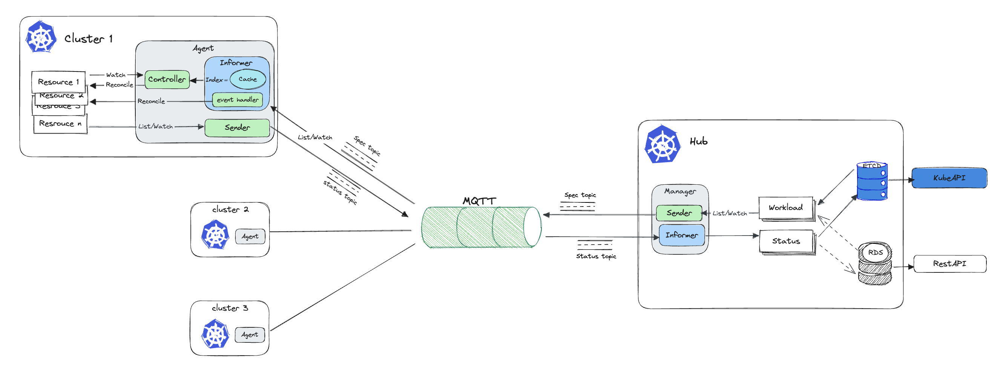

# MQTT Informer

## Start eclipse-mosquitto MQTT Broker
```bash
echo "listener 1883 0.0.0.0
allow_anonymous true" > samples/mosquitto.conf
docker run --rm --name mosquitto -p 1883:1883 -v "$(pwd)/samples/mosquitto.conf:/mosquitto/config/mosquitto.conf" eclipse-mosquitto
```

## Does the informer have to reflect ETCD?
| https://github.com/qiujian16/events-informer


## Scenario 1: As a monitor to view resources from clusters


### Demo
| Branch: view 
```bash
# build binary
make build
# cluster1 cluster
./bin/syncer --broker tcp://127.0.0.1:1883 --client-id sourceId --signal-topic /signal --payload-topic /payload --cluster cluster1
# controlplane cluster
./bin/controlplane --broker tcp://127.0.0.1:1883 --client-id controlplaneId --signal-topic /signal --payload-topic /payload
```
> Create/update/delete resource on cluster1, then check the resource on controlplane cluster

### Pros
- Using informer's List and Watch mechanism, which can ensure the consistency of data from the clusters end to the hub side.
- The hub side can extend scalability by connecting the informer to a persistent database
  - Replace the informer local cache with a database(RDB/KV)
  - Persist the resources to the RDB/KV database in the informer's event handler(For scalability, LocalCache needs to be disabled)


### Cons
- How to distribute the workload from hub to these clusters?
- How to reconcile the cluster resources by the hub spec, such as deleting a resource on the cluster to ensure it can be recreated?
- How to view the cluster resources status from hub view?

## Scenario 2: Use bidirectional informer to deploy workload to cluster


### Demo
```bash
./bin/agent --broker tcp://127.0.0.1:1883 --client-id sourceId --signal-topic /signal --payload-topic /payload --cluster cluster1
./bin/hub --broker tcp://127.0.0.1:1883 --client-id controlplaneId --signal-topic /signal --payload-topic /payload
```

#### Cons
- How to define the Cluster CRD and manage it's lifecycle
- How to handle workload scheduling, like the Placement in OCM?