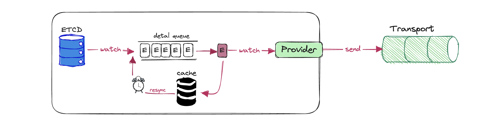

# Transport Informer

## Background
### Does the informer have to reflect ETCD? 


Kubernetes utilizes in-memory caching to effectively reduce the load pressure on the API server caused by a large number of controllers. The consistency between this cache and the persistent layer is ensured by ETCD, which provides a reliable List/Watch interface. So that the [informers can watch the desired sate of resources in a scalable and sustainable fashion. Beyond that, they also implement a resync mechanism that enforces periodic reconciliation, and is often used to make sure that the cluster state and the assumed state cached in memory do not drift(e.g., due bugs or network issues)](https://www.oreilly.com/library/view/programming-kubernetes/9781492047094/ch01.html).


So far everything seems fine, but if we need to see the deployed resource not just in one cluster, but in multiple clusters. At this time, [8G's ETCD](https://github.com/etcd-io/etcd/issues/9771) might be inadequate. A more straightforward idea is to replace ETCD with other scalable databases, like kine, as an etcdshim that translates ETCD API to Postgres, MqSql and SQLit. Anther way is to find a reliably method for the controlplane to take advantage of ETCDs distributed on different clusters？

### Transporter might be an interesting candidate!


Transport(Message Queue) can **decouple**, improve **scalability**, and peak shaving and valley filling of the **flow rate**. These excellent features not only shine in application services, But also should be of great value to platform management.


The Kubernetes controller achieves the desired state of the resource through event accumulation. The message queue is to change the state of a real object through data streaming. There seem to be some similarities between Kubernetes Event and Transport Message.

In order to gain a large scalability, [Mutilcluster-Global-Hub](https://github.com/stolostron/multicluster-global-hub) brings transport to increases the cluster fleet size of the management. While to ensure data consistency, the agent sends all object status data of a certain type each time, which is called a bundle. And also the manager has a complex message confirmation methods. Which seems not elegant enough and CloudNative.

### How to make this informer to watch the transport message instead of ETCD event?


To eliminate the gap between transport and ETCD, the first issue need to be addressed is:
How to make transport respond to Informer's List/Watch like ETCD? Thanks to the [event-informer](https://github.com/qiujian16/events-informer) for bringing us an idea. 

### How to make Transport as reliable as ETCD？

By introducing a custom Transport, we also bring an additional layer that is responsible for communication between the client and the data store. While we can configure the transport to handle failures or errors to decrease the risk of losing data, we still cannot guarantee that the transport will be as reliable as ETCD. 

#### Take advantage of the informer resync mechanism
In order to improve the robustness of reconciliation in Informer, the resync mechanism is used to synchronize the full cache to the delta queue. This make the reconciliation process to handle failures or discrepancies gracefully. This also brings us a way to enhance the reliability of transport.


~~ that is, to add a mechanism to resync full data on transport. There are two ways to achieve it: 
- Informer lists all the resources from transport Periodically 
- The provider periodically sends all objects of a GVR from transport to Informer's watch channel, and Informer determines whether to process them based on a message version ~~

#### MQTT 
- Add message [acknowledgment mechanism](https://www.hivemq.com/blog/mqtt-essentials-part-6-mqtt-quality-of-service-levels/)
    - QoS 1: A balance between reliability and efficiency, guaranteeing that the message reaches the receiver at least once while allowing for potential duplicates to be handled appropriately.
    - QoS 2:  Be aware of the overhead and that the QoS 2 interaction takes more time to complete.

- [Persistent sessions](https://www.hivemq.com/blog/mqtt-essentials-part-7-persistent-session-queuing-messages/)
    > Persistent sessions in MQTT allow a client to maintain its subscription and message state across multiple connections. When a client establishes a persistent session with an MQTT broker, the broker stores the client’s subscription information and any undelivered messages intended for the client. This way, if the client disconnects and reconnects later, it can resume communication seamlessly.

- Message Ordering: QoS 0 and QoS 2


| Now I will use MQTT as a transport to integrate with informer to do some interesting experiments.


## Start a transport: eclipse-mosquitto MQTT Broker
```bash
echo "listener 1883 0.0.0.0
allow_anonymous true" > samples/mosquitto.conf
docker run --rm --name mosquitto -p 1883:1883 -v "$(pwd)/samples/mosquitto.conf:/mosquitto/config/mosquitto.conf" eclipse-mosquitto
```

## Scenario 1: As a monitor to view resources of clusters


### Demo
```bash
# build binary
make build
# cluster1 cluster
./bin/provider --broker 127.0.0.1:1883 --client-id providerId --provider-send /provider/payload --provider-receive /informer/signal --cluster cluster1
# controlplane cluster
./bin/informer --broker 127.0.0.1:1883 --client-id informerId --informer-send /informer/signal --informer-receive /provider/payload
```
> Create/update/delete resource on cluster1, then check the resource on controlplane cluster

### Pros
- Using informer's List and Watch mechanism, which can ensure the consistency of data from the clusters end to the hub side.
- The hub side can extend scalability by connecting the informer to a persistent database
  - Replace the informer local cache with a database(RDB/KV)
  - Persist the resources to the RDB/KV database in the informer's event handler(For scalability, LocalCache needs to be disabled)


### Cons
- How to distribute the workload from hub to these clusters?
- How to reconcile the cluster resources by the hub spec, such as deleting a resource on the cluster to ensure it can be recreated?
- How to view the cluster resources status from hub view?

## Scenario 2: Using bidirectional informer to deploy workload


### Demo
| Define all the topic based on hub
```bash
make build
# cluster1 cluster
./bin/agent --broker 127.0.0.1:1883 --client-id agentId --provider-send /manager/informer/payload --provider-receive /manager/informer/signal --informer-send /manager/provider/signal --informer-receive /manager/provider/payload --cluster cluster1
# hub cluster
./bin/manager --broker 127.0.0.1:1883 --client-id managerId --provider-send /manager/provider/payload --provider-receive manager/provider/signal --informer-send /manager/informer/signal --informer-receive /manager/informer/payload
```

#### Cons
- How to define the Cluster CRD and manage it's lifecycle? 
- How to handle workload scheduling, like the Placement in OCM?