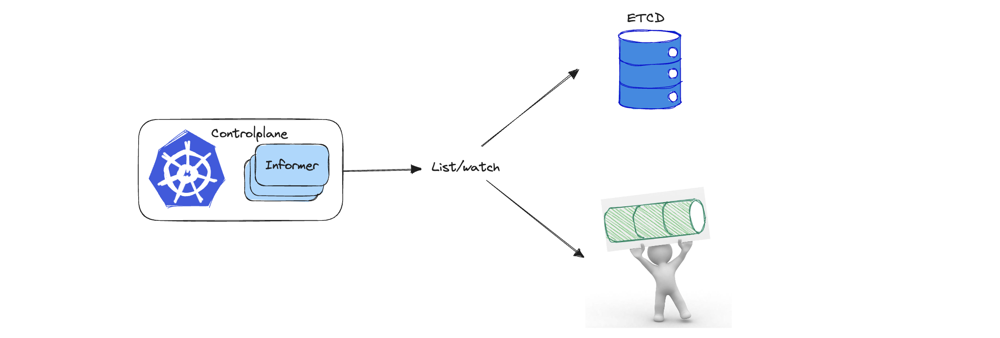

# Transport Informer

## Background
### Does the informer have to reflect ETCD? 

### Transporter might be an interesting candidate!


Transport(Message Queue) can **decouple**, improve **scalability**, and peak shaving and valley filling of the **flow rate**. These excellent features not only shine in application services, but also should also have important value in platform management. But when considering to use message queue, the topic that can't always be avoided is how to ensure **data consistency**.

In order to gain a large scalability, [Mutilcluster-Global-Hub](https://github.com/stolostron/multicluster-global-hub) brings transport to increases the cluster fleet size of the management. While to ensure data consistency, the agent sends all object status data of a certain type each time, which is called a bundle. And also the manager has a complex message confirmation methods. Which seems not elegant enough and CloudNative. 


In fact, to ensure the ETCD data and kubernetes informer local cache to be consistent, the List/watch mechanism comes out in time. Regularly synchronize full data to ensure that the data will not be lost, and watch incremental update to avoid load performance degradation caused by synchronizing full data each time. In addition, there seems to be too much in common between Watch's Event and Transport's Message. So I have been thinking about how to make this informer to watch the message from transport instead of event from ETCD, this will definitely bring new value to Cloud platform management. 


<!--  -->
In eliminating the gap between transport as Informer's data source, there is an important issue that needs to be addressed:
How to make transport respond to Informer's List/Watch like ETCD? Thanks to the [event-informer](https://github.com/qiujian16/events-informer) for bringing us an idea to solve this problem.

| Now I will use MQTT as a transport to integrate with informer to do some interesting experiments.

<!--  -->


## Start a transport: eclipse-mosquitto MQTT Broker
```bash
echo "listener 1883 0.0.0.0
allow_anonymous true" > samples/mosquitto.conf
docker run --rm --name mosquitto -p 1883:1883 -v "$(pwd)/samples/mosquitto.conf:/mosquitto/config/mosquitto.conf" eclipse-mosquitto
```

## Scenario 1: As a monitor to view resources of clusters


### Demo
```bash
# build binary
make build
# cluster1 cluster
./bin/provider --broker tcp://127.0.0.1:1883 --client-id sourceId --signal /signal --payload /payload --cluster cluster1
# controlplane cluster
./bin/informer --broker tcp://127.0.0.1:1883 --client-id controlplaneId --signal /signal --payload /payload
```
> Create/update/delete resource on cluster1, then check the resource on controlplane cluster

### Pros
- Using informer's List and Watch mechanism, which can ensure the consistency of data from the clusters end to the hub side.
- The hub side can extend scalability by connecting the informer to a persistent database
  - Replace the informer local cache with a database(RDB/KV)
  - Persist the resources to the RDB/KV database in the informer's event handler(For scalability, LocalCache needs to be disabled)


### Cons
- How to distribute the workload from hub to these clusters?
- How to reconcile the cluster resources by the hub spec, such as deleting a resource on the cluster to ensure it can be recreated?
- How to view the cluster resources status from hub view?

## Scenario 2: Using bidirectional informer to deploy workload


### Demo
```bash
./bin/agent --broker tcp://127.0.0.1:1883 --client-id sourceId --signal-topic /signal --payload-topic /payload --cluster cluster1
./bin/hub --broker tcp://127.0.0.1:1883 --client-id controlplaneId --signal-topic /signal --payload-topic /payload
```

#### Cons
- How to define the Cluster CRD and manage it's lifecycle
- How to handle workload scheduling, like the Placement in OCM?