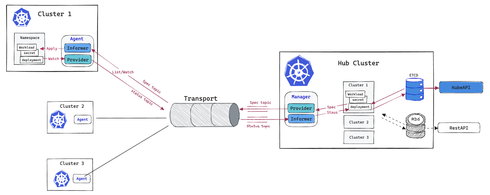

# Straw

==========================

Straw is an etcdshim that consume event from transport instead of etcd. Which enable your Kubernetes to `List/Watch` resources through the **straw**.

## Implements

- Runs an informer to consume(`List/Watch`) resources from a transport
- Implements an etcdshim to translate the transport to etcd API
- Initializes a Provider to send data to the transport
  1. List and watch resources from etcd to local cache
  2. Send resources from the cache to transport
  3. Resend cache data to transport periodically


## One more step

Build a multi-cluster management prototype based on the above implementation. It can achieve the following goals:


- Deploy a resource(`deployment`) on the `cluster1` namespace of `hub`
- The resource(`deployment`) is propagated to `cluster1` by `transport`
- Report the resource status(`deployment.Status.AvailableReplicas`) on `cluster1` to `hub`(add an `AvailableReplicas` annotation to the original `deployment`) through `transport`


## Demo

### Start a MQTT Protocol

To run a sample MQTT broker using docker:

```bash
docker run -it --rm --name mosquitto -p 1883:1883 eclipse-mosquitto:2.0 mosquitto -c /mosquitto-no-auth.conf
# with persistence
docker run -it --rm --name mosquitto -p 1883:1883 -v `pwd`/resource/mosquitto.conf:/mosquitto/config/mosquitto.conf eclipse-mosquitto
```

### Watch Secret by the Transport

```bash
# Build binary
make build

# Run a provider


```

## References

- [event-informer](https://github.com/qiujian16/events-informer)
- [client-go](https://github.com/kubernetes/client-go/tree/master/tools/cache)